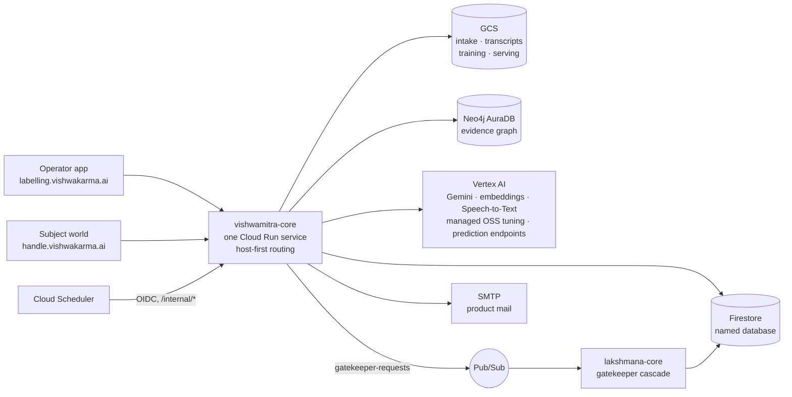

# vishwamitra-core

**Vishwamitra** is the operator console and pipeline behind **Vishwakarma AI**. It takes a person's
raw evidence (recordings, documents, links, testimony), turns it into a ledger of traceable,
authenticity-scored claims, synthesises a training dataset from that ledger, fine-tunes a small
open model into the person's **advocate**, and serves that advocate to guests on the subject's own
subdomain. One Spring Boot service hosts both the operator app and the subject-facing product.

Kotlin 2.3 · Java 17 · Spring Boot 4.1 (MVC, Security, OAuth2 client, Thymeleaf + HTMX) · Arrow-kt ·
Maven + Jib · Firestore · Neo4j · Google Cloud (Cloud Run, GCS, Vertex AI, Speech-to-Text,
Pub/Sub, Cloud Scheduler, Secret Manager).

---

## Contents

- [What it does](#what-it-does)
- [Architecture](#architecture)
- [The pipeline, stage by stage](#the-pipeline-stage-by-stage)
- [Training, versioning and serving](#training-versioning-and-serving)
- [The product layer](#the-product-layer)
- [The operator console](#the-operator-console)
- [Repository layout](#repository-layout)
- [Running locally](#running-locally)
- [Configuration](#configuration)
- [Deployment](#deployment)
- [Documentation](#documentation)
- [Related repositories](#related-repositories)
- [License](#license)

---

## What it does

The system is a staged pipeline. Each stage consumes the previous stage's durable output and
produces its own; stages never share in-memory state.

| Stage | Name | Input | Output | Store |
| --- | --- | --- | --- | --- |
| 1 | Intake and manifest | Raw files and links from the subject | Classified, consented `Asset` rows in a sealed manifest | Firestore + GCS intake bucket |
| 2 | Transcription and claim extraction | Sealed manifest | `Claim` ledger with provenance, plus human review sidecars | Firestore + GCS transcripts bucket |
| 3 | Authenticity scoring | Approved claims | Evidence graph, per-claim authenticity vectors, contradiction queue | Neo4j (graph) + Firestore (published scores) |
| 3.5 | Subject aggregate | Published facts and scores | One subject-level index with bands, and a PDF profile report | Firestore + GCS |
| 4 | Conversation synthesis and tuning | Scored ledger + persona | Judged SFT conversations and DPO pairs, exported JSONL, a tuned model | Firestore + GCS training bucket + Vertex AI |
| — | Serving and product | Tuned checkpoint | The advocate, deployed in time-boxed windows and chatted with by guests | Vertex AI endpoint + Firestore |

Two doctrines shape everything:

- **Two stores, two jobs.** Firestore is the ledger: claims are immutable evidence units, reviews
  are human sidecars, runs are audit records. Neo4j is the workbench: derived state that can be
  dropped per subject and rebuilt from the ledger. Only published score vectors ever flow back from
  the graph to the ledger, which makes Stage 3 disposable and the evidence never at risk.
- **No scheduler.** Every long-running unit of work is a submit-then-poll job. `submit` creates a
  record and returns; each `poll`, driven by the page or an operator, advances it one bounded step
  that fits inside a Cloud Run request. Phases are re-entrant, progress lives in the store, and
  "stuck" is detected by timestamp rather than by a supervisor process.

## Architecture



Requests are routed **host first, then path**. The operator domain gets the operator filter chain;
any `<handle>.<base-domain>` host resolves to a subject and gets the subject chain. The two worlds
share services and data but no controllers and no templates, so an operator URL on a subject host
is a 404 by construction.

All LLM calls go through Vertex AI with application-default credentials. Gemini is the drafting,
extraction, judging and generation model; `gemini-embedding-001` embeds claims; open models are
tuned with Vertex Managed OSS Tuning and served on a Vertex prediction endpoint. Provider rows pin
the model and transport per stage, and a repin is treated as a calibration event.

## The pipeline, stage by stage

### Stage 1: intake and manifest

Subjects or operators register assets against an intake taxonomy of content types (self
interviews, accomplishment stories, résumés, references, artefacts, and so on), each with a source
class and a base prior that later stages inherit. Binary assets upload straight to GCS through V4
signed URLs, so multi-gigabyte audio and video never pass through the app. The manifest is sealed
before Stage 2 starts, and the seal is permanent.

### Stage 2: transcription and claim extraction

One `Stage2Job` per asset: `PENDING → TRANSCRIBING → AWAITING_SPEAKER_SELECTION → EXTRACTING → COMPLETED`.

- Audio and video go through Speech-to-Text v2 `batchRecognize` with diarization. A speaker
  attribution step decides who the subject is; below a confidence gate the job parks and asks a
  human to pick the speaker.
- Images and documents take a multimodal lane: one Gemini call does the reading and the extraction.
- Extraction prompts are per content type, versioned and hashed, and admin-editable at runtime with
  the shipped defaults in [`extraction-prompts.yaml`](src/main/resources/extraction-prompts.yaml).
  Every claim records which prompt version produced it.
- The review layer contextualises rather than censors: reviewers approve, dismiss, or annotate
  claims in sidecar documents, and the extracted claim itself stays immutable.

### Stage 3: authenticity scoring

One `Stage3Run` per pass, advancing through
`SYNCING → RESOLVING_ENTITIES → EMBEDDING → MATCHING → JUDGING → ASSEMBLING → SCORING → AWAITING_REVIEW → PUBLISHING → PUBLISHED`,
with every parameter frozen into a `paramsSnapshot` so the story behind a score never changes
after the fact.

| Phase | What it does |
| --- | --- |
| SYNC | Projects approved claims into the graph |
| RESOLVE_ENTITIES | Extracts the entities claims mention and resolves them into a cross-subject ontology |
| EMBED | Embeds claims, stamped by model and version, so switching transports never marks vectors stale |
| MATCH | Finds related pairs through blocking arms and a precision cascade |
| JUDGE | Judges surviving pairs: a Gemini self-consistency ensemble, or the LLM-free gatekeeper cascade in [lakshmana-core](https://github.com/vishwakarma-ai/lakshmana-core) (`LLM`, `GATEKEEPER`, or `SHADOW` mode), reached over Pub/Sub |
| ASSEMBLE | Lifts pairs into facts with corroboration and contradiction edges and temporal intervals |
| SCORE | Runs a damped trust-propagation fixed point that assigns every claim an authenticity vector |
| Review gate | Parks the run; operators confirm or dismiss contradiction candidates, then publish |

The design goal is one sentence: **no score without a story**. Every number decomposes into the
evidence, judgements, and parameters that produced it. An evaluation harness with golden pairs and
a deterministic dry-run engine double let the whole pipeline run offline in the `dev` profile.

### Stage 3.5: the subject aggregate

Per-claim scores are deliberately generous at the top, so a single subject-level number is computed
separately: fact-level, mass-weighted, and stricter, combined from five components into bands. It
feeds the product's consolidated score and a PDF profile report rendered from Thymeleaf through
openhtmltopdf to one fixed object per subject.

### Stage 4: conversation synthesis and tuning

Stage 4 reads only the Firestore ledger, never the graph. A `Stage4Run` advances through
`SELECTING → PLANNING → GENERATING → JUDGING → REVIEW_WAIT → DONE`.

- **Persona wizard.** The subject's voice and boundaries, merged with operator presets.
- **Voicing planner.** A pure function over a claim's score vector and review state decides *what
  may be said and how confidently*; the LLM only writes words inside the selected row's constraints.
  Re-planning without re-generating reproduces identical plans.
- **Spec-driven generation.** Notebook templates across dozens of conversation categories, a
  posture-labelled knowledge base built from the ledger, situational chain-of-thought specs, and
  trained-in system prompts (a profile header, per-template rules written once per template, and a
  rotating claim subset) so the tuned model learns exactly the facts it may assert.
- **Judge and review.** A four-axis Gemini judge grades every conversation; humans review the
  queue with bulk approve and override, and judged verdicts accumulate as a distillation set.
- **DPO pairs** are constructed from judged conversations for preference tuning.
- **Traceability.** Every conversation stamps its source claim ids, score run, category,
  voicing-plan hash, prompt version, and persona hash.
- **Post-tune evaluation.** Hand-authored probes exercise the planner's rows against the tuned
  model, served either on the shared endpoint or a dev vLLM box.

## Training, versioning and serving

- **Authoring.** SFT transcripts (multi-turn, including tool-call and tool-response turns drawn from
  an admin-editable tool catalog) and DPO preference pairs, LLM-assisted with a manual fallback,
  with a `DRAFT → SUBMITTED → APPROVED / NEEDS_CHANGES → ARCHIVED` lifecycle.
- **Export.** Approved examples serialise to JSONL in either the Vertex `contents`/`parts` shape or
  the OpenAI-style `messages` shape (which carries the trained-in system prompt), pass structural
  validation, land as timestamped snapshots in the training bucket, and stamp `exportedIn` on every
  included example. Externally produced JSONL can be imported and validated the same way.
- **Tuning.** Vertex Managed OSS Tuning jobs are submitted and polled from the UI: supervised or
  preference optimisation, LoRA or full tune, foundation or continuation on top of a prior version.
  Versions are `vMAJOR.MINOR` per base-model family, so architectures never cross lineages, with a
  single global `current` promotion per family. The base-model catalog covers Qwen 3 and 3.5, Gemma
  3 and 4, MedGemma and Llama 3.2 rows, each flagged tunable, hostable, or serve-verified.
- **Serving.** A tuned checkpoint is located by content in the serving bucket, staged once into the
  serving region, and deployed onto a shared Vertex prediction endpoint (upload model, then deploy;
  teardown is one undeploy). Serving is behind a backend seam and dry-run in development. The one
  held GPU has one occupant: an advocate window and an operator serve exclude each other.

## The product layer

Each subject gets `<handle>.vishwakarma.ai`, served by the same application.

| Surface | Path on the subject host | Who |
| --- | --- | --- |
| Advocate chat | `/` | Guests with an access code, or the subject after Google sign-in |
| Training | `/training` | The subject: upload, progress, speaker selection, review wizard, questions inbox, token dashboard, provisioning switch |
| Access wall | `/s/wall` | Guests redeem a code; attempts are rate-limited with lockout |

- **Guest access codes** are HMAC-peppered tokens with a per-subject cap, listed and revoked from
  the subject's dashboard; sessions carry a TTL, a message cap, and a send pace.
- **Provisioning windows** (one day, three days, one week) deploy the subject's advocate and tear it
  down automatically through an OIDC-authenticated sweep endpoint called by Cloud Scheduler. A
  deployed replica bills until it is gone, so teardown is the cost guard.
- **Clarification questions** are drawn for weakly evidenced claims when review locks, and the
  subject answers them from the inbox.
- **Consent and terms** are accepted once through a terms gate; product mail goes out over plain
  SMTP with a daily cap; the subject's declared profile and shareable contact fields ride an opt-in
  path into the ledger.
- A public site (`/p`) carries the landing pages, the use-case catalogs for individuals and
  businesses, and the policy texts, plus a static [data-collection guide](src/main/resources/static/user-guide/)
  on how to record and gather evidence that scores well.

## The operator console

Roles come from a Google OAuth allowlist and a hosted-domain gate: `AUTHOR`, `REVIEWER`, `ADMIN`,
plus `SUBJECT` for the product side. In the `dev` profile OAuth is bypassed and every request is a
fixed admin.

| Area | Path | What |
| --- | --- | --- |
| Dashboard and intake | `/home`, `/intake` | Counts, current model, recent exports; per-subject intake, Stage 2, review, Stage 3, Stage 4 pages |
| Stage 3 surfaces | `/intake/{id}/stage3`, `…/scores`, `…/contradictions`, `…/timeline` | Run page with phase counters, scored claims, contradiction queue, timeline |
| Authoring | `/sft`, `/dpo` | Editors, review queue, judge-verdict and plan panels for generated notebooks |
| Data | `/export`, `/import`, `/training` | Snapshot exports with a format picker and history, dataset imports, tuning jobs |
| Models | `/models`, `/models/advocates` | Versions and promotion, serve controls, advocate registrations and windows |
| Admin | `/admin/*`, `/admin/stages` | Tool catalog, base models, taxonomy, scenarios, users, provider pins, extraction prompts, entity browser, Stage 3 evaluation dashboard, per-stage live configuration with masked secrets |
| JSON APIs | `/api/intake`, `/api/stage2`, `/api/stage3`, `/api/stage4`, `/api/admin/status` | The polling and action endpoints behind the pages; the status endpoint reports every stage's dry-run posture and wiring |

## Repository layout

```
src/main/kotlin/ai/vishwakarma/labelling/
  config/         AppProperties (app.* binding, one section per stage), Firestore and Neo4j clients, seeding
  domain/         Subject, Asset, IntakeManifest, Claim, ClaimReview, Stage2/3/4 runs, SftExample, DpoPair,
                  ExportRecord, Training, BaseModel, Advocate*, SubjectProfile, NotebookTemplate, StageConfig
  persistence/    one repository per Firestore collection, plus the Stage 3 publish contract
  security/       OAuth allowlist, dev bypass, host-first routing, subject and guest contexts, terms gate,
                  OIDC filter for the internal endpoints
  stage2/         Speech-to-Text transcriber, speaker attribution, document lane, claim extractor
  stage3/         graph repository, entity extraction and resolution, embeddings, matcher, judge, fact
                  assembler, scorer, subject scorer, publish projection, gatekeeper client
  stage4/         knowledge base, planning, voicing planner, system prompts and rules, generation, judging,
                  DPO generation, evaluation probes and grading
  drafting/       Gemini and Claude drafting providers, transports, thinking-config mapping
  vertex/         managed tuning jobs, endpoint client, backoff
  serving/        the ServingBackend seam and its Vertex implementation
  gcs/            intake storage (signed URLs), exporter, checkpoint locator, serving stager
  serialization/  contents/parts and OpenAI-chat serializers, tool-call mapper, validators
  service/        orchestration: intake, Stage 2/3/4, training, export, import, provisioning, chat,
                  tokens, questions, mail, profiles, catalogs, stage configuration
  report/         SVG charts and the PDF profile report
  web/            Thymeleaf controllers and JSON API controllers
src/main/resources/
  application.yml           dev and prod profiles
  extraction-prompts.yaml   shipped per-content-type extraction prompts
  templates/                operator, subject, public and report views (Thymeleaf + HTMX)
  static/                   CSS, JS, the landing page, the data-collection guide
src/test/kotlin/            about 930 tests across domain, services, stages, security and web
scripts/                    Firestore emulator backup and restore
compose.yaml                local Neo4j
cloudbuild.yaml             Cloud Build: Jib image build and Cloud Run deploy
```

## Running locally

Prerequisites: JDK 17, Docker, the Google Cloud CLI with the Firestore emulator component.

```bash
# Neo4j (the Stage 3 graph is always real locally)
docker compose up -d neo4j

# Firestore emulator; the project id must match the app's GCP_PROJECT_ID
gcloud beta emulators firestore start --host-port=127.0.0.1:8082 --project=vishwakarma-ai-poc

# the app, dev profile: OAuth bypassed, LLM legs stubbed, tuning and serving simulated
FIRESTORE_EMULATOR_HOST=127.0.0.1:8082 ./mvnw spring-boot:run \
  -Dspring-boot.run.profiles=dev \
  -Dspring-boot.run.jvmArguments="-Djava.net.preferIPv4Stack=true"
```

Then open http://localhost:8080. Catalogs are seeded on first start; set `DEV_SEED=true` to also
seed a development subject with a live advocate. The emulator speaks plaintext gRPC, which the
Firestore client is wired for when `FIRESTORE_EMULATOR_HOST` is set; the IPv4 flag avoids a
Netty dual-stack failure on macOS loopback.

What is real versus stubbed in `dev`: Firestore (emulator) and Neo4j are real; transcription,
extraction, embeddings, judging, generation, tuning, serving, and gatekeeper publishing are
deterministic doubles unless flipped per stage. The `/api/admin/status` endpoint and the run pages
show the posture. A ready-made Stage 3 corpus lets the full graph pipeline run without a single LLM
call, and each live leg can be enabled individually with application-default credentials; the
runbook covers both paths.

```bash
./mvnw test                 # the suite, dev profile
./mvnw spotless:apply       # ktfmt formatting, also checked at compile time
./mvnw compile jib:build -Dimage=<registry>/<repo>/labelling:<tag>   # container image, no Dockerfile
```

`scripts/firestore-emulator-backup.sh` and `scripts/firestore-emulator-restore.sh` snapshot and
restore the emulator's named database so a development dataset survives emulator restarts.

## Configuration

Everything binds under `app.*` in [`application.yml`](src/main/resources/application.yml), with an
environment override per key. Two profiles: `dev` (local) and `prod` (Cloud Run). Selected settings:

| Environment variable | Purpose |
| --- | --- |
| `GCP_PROJECT_ID`, `GCP_REGION`, `FIRESTORE_DATABASE` | Project, home region, and the named Firestore database (never `(default)`) |
| `INTAKE_BUCKET`, `TRANSCRIPTS_BUCKET`, `TRAINING_BUCKET`, `SERVING_BUCKET` | The four GCS buckets; blank intake bucket in dev means local-disk uploads |
| `GEMINI_LOCATION`, `GEMINI_TRANSPORT`, `GEMINI_API_KEY` | Vertex location for Gemini, and the `vertex` or `gemini-api` door |
| `HOSTED_DOMAIN`, `BOOTSTRAP_ADMINS`, `GOOGLE_OAUTH_CLIENT_ID`, `GOOGLE_OAUTH_CLIENT_SECRET` | Sign-in gate, first admins, OAuth client (from Secret Manager in prod) |
| `NEO4J_URI`, `NEO4J_USER`, `NEO4J_PASSWORD`, `NEO4J_DATABASE` | The graph; AuraDB over `neo4j+s://` in prod |
| `STAGE2_STT_MODEL`, `STAGE2_STT_LANGUAGE`, `STAGE2_MAX_SPEAKERS` | Transcription |
| `STAGE3_EMBEDDING_TRANSPORT`, `STAGE3_JUDGE_MODE`, `STAGE3_JUDGE_THINKING_BUDGET`, `STAGE3_DRY_RUN` | Stage 3 legs; judge mode is `LLM`, `GATEKEEPER`, or `SHADOW` |
| `GATEKEEPER_TOPIC`, `GATEKEEPER_PROJECT_ID`, `GATEKEEPER_DRYRUN` | The one Pub/Sub topic this app publishes to; blank topic means publishing is a no-op |
| `TUNING_BASE_MODEL`, `TUNING_REGION`, `APP_TUNING_DRYRUN` | Managed tuning defaults; some catalogs are region-specific |
| `SERVING_ENABLED`, `SERVING_DRYRUN`, `SERVING_REGION`, `SERVING_ENDPOINT_ID`, `SERVING_IMAGE`, `SERVING_STAGING_BUCKET`, `SERVING_HOURLY_USD` | The shared endpoint, serving container, staging bucket, and the window cost estimate |
| `PRODUCT_BASE_DOMAIN`, `PRODUCT_OPERATOR_DOMAIN`, `ADVOCATE_TOKEN_PEPPER`, `PRODUCT_TOKEN_CAP`, `PRODUCT_GUEST_SESSION_TTL` | Host routing and guest access; the pepper is required outside dev and comes from Secret Manager |
| `SMTP_HOST`, `SMTP_USERNAME`, `SMTP_APP_PASSWORD`, `PRODUCT_MAIL_FROM`, `PRODUCT_MAIL_DAILY_CAP` | Product mail |
| `INTERNAL_AUDIENCE`, `INTERNAL_INVOKER` | OIDC audience and invoker for the Cloud Scheduler sweep endpoints |

Per-stage dials that are safe to change at runtime are also editable from the admin console; secret
fields render masked and are never stored. Model pins, thinking budgets, and transports live in
provider rows, and every run freezes the values it used into its own snapshot.

## Deployment

The service runs on Cloud Run behind a global external load balancer with a wildcard certificate,
so the operator domain and every subject subdomain reach the same revision. Cloud Build
([`cloudbuild.yaml`](cloudbuild.yaml)) builds the image with Jib straight from Maven, pushes it to
Artifact Registry tagged with the commit SHA, and rolls it onto the Cloud Run service. The runtime
environment, OAuth secrets, buckets, scheduler jobs, Pub/Sub topic, and IAM are managed by
Terraform in the sibling `vishwamitra-infra` repository; the `prod` profile requires the OAuth
client from Secret Manager and turns every live leg on.

## Documentation

- [`the-nebuchadnezzar.md`](the-nebuchadnezzar.md): a complete technical treatise on Stages 2 and 3,
  generated from source, citing the file and line behind every mechanism, with the real prompts and
  Cypher, the scoring mathematics, the evaluation harness, and the operational surface.
- [`RUNBOOK-local.md`](RUNBOOK-local.md): the operator runbook for a full local Stage 1 to 3 loop,
  the dry-run corpus demo, live-LLM variants, resets, and troubleshooting.
- [`labelling-tool-plan.md`](labelling-tool-plan.md): the original plan and locked decisions for the
  labelling and training console the product grew out of.
- The static data-collection guide under `src/main/resources/static/user-guide/`.

## Related repositories

- [lakshmana-core](https://github.com/vishwakarma-ai/lakshmana-core): the LLM-free gatekeeper
  cascade that can take over Stage 3 judging.
- `vishwamitra-infra` and `lakshmana-infra`: Terraform for the two services.

## License

[MIT](LICENSE).
